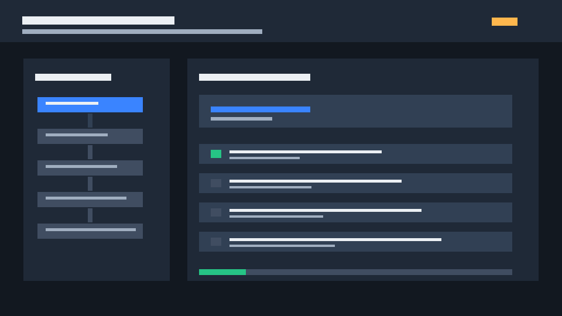

# Anti-AI Slop Skill

Anti-AI Slop is a Codex skill for reviewing and improving outputs that feel generic, template-like, over-smoothed, or AI-scented.

It is not an AI detector. It does not decide whether a person used AI. It reviews visible quality signals: weak specificity, proof-shaped unreliability, generic rhythm, decorative UI, fake precision, unowned code, chart slop, localization mismatch, and other patterns that reduce trust or usefulness.

Use it when you want an agent to turn “this smells like AI slop” into an evidence-based review and a concrete revision plan.

This repository is now also a Spec Kit style Codex guardrail pack. It adds persistent principles, reusable prompts, validator scripts, CI examples, process docs, and a sample feature spec around the original review skill.

## Choose a Mode

| Mode | Use when | Start here |
|---|---|---|
| Review skill | You want critique, rewrite guidance, or output QA for one artifact. | `$anti-ai-slop Review ...` |
| Guardrail pack | You want repository-level specs, prompts, validators, CI examples, and migration helpers. | `python tools\validators\check_all.py --root . --profile pack-self --format markdown` |

For a new checkout, run the validation gate first:

```powershell
python tools\validators\check_all.py --root . --profile pack-self --format markdown
python -m unittest discover -s tests
```



Regenerate the README demo GIF with:

```powershell
python tools\generate_readme_demo_gif.py
```

## Guardrail Pack Mode

Use the pack when you want the anti-slop review discipline to govern a whole repository, not only one draft.

Core files:

- `.specify/memory/constitution.md`
- `.specify/memory/glossary.md`
- `.specify/memory/architecture-principles.md`
- `.specify/memory/product-principles.md`
- `.specify/templates/overrides/*`
- `AGENTS.md`
- `.agents/skills/*/SKILL.md`
- `codex/prompts/*.md`
- `tools/validators/check_all.py`
- `docs/process/*`
- `docs/references/*`
- `specs/000-anti-ai-slop-control-plane/*`

Run the local coherence gate:

```powershell
python tools\validators\check_all.py --root . --profile pack-self --format markdown
```

Validator surface:

- `tools/validators/check_all.py`
- `tools/validators/check_config_integrity.py`
- `tools/validators/check_task_traceability.py`
- `tools/validators/check_spec_coverage.py`
- `tools/validators/check_evidence_links.py`
- `tools/validators/check_glossary_terms.py`
- `tools/validators/check_architecture_boundaries.py`
- `tools/validators/check_dependency_justification.py`
- `tools/validators/check_manifest_integrity.py`
- `tools/validators/check_resource_catalog_freshness.py`
- `tools/validators/check_template_tokens.py`
- `tools/validators/check_workflow_integrity.py`
- `tools/validators/check_vague_language.py`
- `tools/validators/check_placeholders.py`

Validation profiles:

| Profile | Scope |
|---|---|
| `pack-self` | Full self-check for this guardrail pack. |
| `target-repo` | Service-code-oriented paths in a repository that adopted the pack. |
| `feature --feature 123-feature-name` | Findings scoped to one feature directory under `specs/`. |
| `ci-strict` | CI gate using the full pack scope. |

Generate inventory evidence:

```powershell
python tools\repo_inventory.py --root . --out specs\_meta\evidence\existing-code-scan.md
python tools\repo_inventory.py --root . --format json --out specs\_meta\evidence\existing-code-scan.json
```

Bootstrap a feature workspace from the local Spec Kit override templates:

```powershell
python tools\bootstrap_feature.py 123-feature-name --name "Feature Name" --arguments "Original feature request"
```

Apply the guardrails to another repository:

```powershell
python tools\apply_guardrails.py --target C:\path\to\repo --mode dry-run
python tools\apply_guardrails.py --target C:\path\to\repo --mode merge --manifest-out C:\path\to\repo\.anti-ai-slop-apply-manifest.json
```

Apply behavior:

- `dry-run` reports planned copies and does not write inside the target repository.
- `--json-out` can save a dry-run report, but the output path must be outside the target repository.
- `merge` copies missing guardrail files from the maintained `manifest.txt` surface only.
- Existing target files are preserved.
- Test-only files and generated cache artifacts such as `tests/`, `__pycache__`, `*.pyc`, and `.pytest_cache` are ignored in dry-run and merge plans.
- Missing or unsafe manifest entries are reported as warnings in stderr and JSON reports.

Other guardrail maintenance tools:

- `tools/resource_catalog_freshness.py`
- `dependency-baseline.json`

## Prompt Collection

Start from the prompt library when you want a ready-to-run request:

```text
PROMPTS.md
```

- [Open the prompt collection](PROMPTS.md)
- [Review prompts](PROMPTS.md#review-prompts)
- [Rewrite prompts](PROMPTS.md#rewrite-prompts)
- [UI and visual prompts](PROMPTS.md#ui-and-visual-prompts)
- [Code and PR prompts](PROMPTS.md#code-and-pr-prompts)
- [Data, localization, and planning prompts](PROMPTS.md#data-localization-and-planning-prompts)
- [Research-aware prompts](PROMPTS.md#research-aware-prompts)
- [Template prompts](PROMPTS.md#template-prompts)

## Quick Start

Install the skill into your Codex skills directory:

```powershell
git clone https://github.com/ch040602/anti-ai-slop.git C:\Users\%USERNAME%\.codex\skills\anti-ai-slop
```

Then start a new Codex session so the skill list is refreshed.

Use it explicitly:

```text
$anti-ai-slop Review this landing page copy for AI slop and rewrite the weak parts.
```

```text
$anti-ai-slop Audit this README for generic-output patterns, missing proof, and concrete fixes.
```

```text
$anti-ai-slop Check this UI concept for SaaS-average design slop and give component-level changes.
```

If your Codex environment already has the skill installed locally, the usable skill name is:

```text
anti-ai-slop
```

## What It Does

Anti-AI Slop helps review and improve:

- writing, documentation, README files, and explainers;
- academic, analytical, policy, and executive reports;
- marketing copy, landing pages, product pages, and sales material;
- essays, founder notes, social posts, and thought-leadership drafts;
- websites, SaaS UI, dashboards, app screens, and design systems;
- slide decks, pitch decks, lecture decks, and executive presentations;
- generated images, thumbnails, hero visuals, mockups, and visual concepts;
- code snippets, PR descriptions, technical docs, scripts, and generated frontend;
- charts, KPI cards, analytics screenshots, and BI mockups;
- localized, translated, bilingual, or region-specific outputs;
- roadmaps, implementation plans, launch plans, and operational specs.

The skill turns broad critique into specific revision work:

```text
visible evidence
-> signal category
-> false-positive check
-> contract impact
-> specificity input needed
-> remediation pattern
-> concrete revision
-> verification criterion
```

## What It Does Not Do

Anti-AI Slop does not:

- make forensic authorship claims;
- accuse a person or organization of using AI;
- optimize text to evade AI detectors;
- replace factual verification, legal review, security review, accessibility review, or domain expert review;
- remove useful structure just because it resembles a common AI pattern.

Good structure, clean grammar, simple language, common fonts, cards, bullets, or polished visuals are not defects by themselves. They become issues only when they weaken purpose, credibility, specificity, usability, or brand fit.

## How It Works

The review skill remains Markdown-first. The guardrail pack adds optional standard-library Python validators and helper scripts. There is no runtime service, package install, API key, or background process.

When invoked, the agent should:

1. Read `SKILL.md`.
2. Define the output contract: audience, job, medium, constraints, evidence needs, and success condition.
3. Classify the work purpose using `taxonomies/task_purpose_matrix.md`.
4. Run the universal gate in `protocols/output_design_review_gate.md`.
5. Load the relevant modality file under `dimensions/`.
6. Use `research/field_reported_ai_smell_patterns.md` when the task asks about AI slop, AI-smell, detector-like cleanup, Reddit/GitHub-reported patterns, PR slop, code slop, or public perception patterns.
7. Format findings with `protocols/finding_format.md`.
8. Apply fixes from `checklists/remediation_patterns.md`.
9. Deliver a review report, rewrite brief, design addendum, or revised output using `templates/`.

For repository-level work, start from `codex/prompts/00-apply-pack-to-existing-repo.md` and follow:

```text
inventory
-> constitution / glossary / architecture principles
-> spec
-> clarify
-> checklist
-> plan
-> tasks
-> analyze
-> implementation
-> validation evidence
-> PR review
```

## Installation

### Codex

Clone this repository into your Codex skills directory:

```powershell
git clone https://github.com/ch040602/anti-ai-slop.git C:\Users\%USERNAME%\.codex\skills\anti-ai-slop
```

Restart Codex or start a new session.

### Claude Code

Claude Code can use this repository in two ways:

1. As a skill: copy or clone this repository to `.claude/skills/anti-ai-slop/` or your user-level Claude skills directory, keeping `SKILL.md` at the skill root. Invoke it with `/anti-ai-slop` when slash skills are available.
2. As a repository guardrail pack: apply the pack to a target repository, then keep `CLAUDE.md`, `SKILL.md`, `.specify/`, `docs/`, `codex/prompts/`, and `tools/validators/` under version control.

Example project-local skill install:

```powershell
mkdir .claude\skills
git clone https://github.com/ch040602/anti-ai-slop.git .claude\skills\anti-ai-slop
```

Example guardrail-pack install:

```powershell
git clone https://github.com/ch040602/anti-ai-slop.git C:\tmp\anti-ai-slop
python C:\tmp\anti-ai-slop\tools\apply_guardrails.py --source C:\tmp\anti-ai-slop --target C:\path\to\repo --mode dry-run
python C:\tmp\anti-ai-slop\tools\apply_guardrails.py --source C:\tmp\anti-ai-slop --target C:\path\to\repo --mode merge --manifest-out C:\path\to\repo\.anti-ai-slop-apply-manifest.json
```

Claude Code reads project guidance from `CLAUDE.md`, and Claude skills use `SKILL.md` files. This repository includes both `AGENTS.md` for Codex-style agents and `CLAUDE.md` for Claude Code project guidance. See Anthropic's Claude Code docs for [memory files](https://docs.anthropic.com/en/docs/claude-code/memory) and [skills](https://docs.anthropic.com/en/docs/claude-code/skills).

### Other Agent Runtimes

The guardrail pack is agent-agnostic at the repository level:

- Use `SKILL.md` as the primary human/agent instruction file.
- Use `AGENTS.md` for Codex-compatible agents.
- Use `CLAUDE.md` for Claude Code.
- Use `codex/prompts/*.md` as portable prompt templates even outside Codex.
- Use `tools/validators/check_all.py` in local scripts or CI to enforce the same checks without relying on any agent runtime.

Minimal non-Codex workflow:

```powershell
python tools\apply_guardrails.py --source C:\tmp\anti-ai-slop --target C:\path\to\repo --mode merge
python C:\path\to\repo\tools\validators\check_all.py --root C:\path\to\repo --profile target-repo --format markdown
```

### Manual Copy

Copy the repository folder into any Codex-compatible skills directory:

```text
<codex-home>/skills/anti-ai-slop/
```

The root file must remain:

```text
SKILL.md
```

### From an Existing Checkout

If you already cloned the repository elsewhere, copy or symlink the folder into your skills directory. Keep the directory name and frontmatter name aligned:

```yaml
name: anti-ai-slop
```

## Usage

### Review Mode

Use when you want critique and fixes:

```text
$anti-ai-slop Review this report for AI slop, unsupported claims, and weak recommendation structure.
```

Expected output:

- verdict;
- output contract;
- scores and readiness;
- signal clusters;
- priority findings;
- concrete fixes;
- acceptance criteria.

### Rewrite Mode

Use when you want the artifact improved directly:

```text
$anti-ai-slop Rewrite this product page so it sounds specific, credible, and less template-like.
```

Expected output:

- short diagnosis;
- missing context if needed;
- revised copy or structure;
- notes on what changed and why.

### Design Addendum Mode

Use when you want QA criteria added to another deliverable:

```text
$anti-ai-slop Add output-quality and anti-slop acceptance criteria to this implementation plan.
```

Expected output:

- purpose-fit checks;
- evidence checks;
- modality-specific QA;
- AI-slop risk notes;
- acceptance criteria.

### Research-Aware Mode

Use when you want field-reported patterns included:

```text
$anti-ai-slop Use the field-reported AI-smell register to audit this LinkedIn post and give a before/after rewrite.
```

The skill should consult `research/field_reported_ai_smell_patterns.md` and still avoid authorship claims.

## Configuration

The review skill is configured by editing Markdown files. The repository guardrail pack also supports optional shared validator config files at `config/guardrails.json`, `config/guardrails.yaml`, and `config/guardrails.yml`; local overlays such as `config/guardrails.local.json` are intentionally rejected until merge semantics are implemented. There is no environment-variable configuration surface.

Common configuration points:

| Need | Edit |
|---|---|
| Change top-level routing or invocation behavior | `SKILL.md` |
| Add or remove universal review gates | `protocols/output_design_review_gate.md` |
| Change severity, scoring, readiness, or finding format | `protocols/finding_format.md` |
| Add a new review workflow step | `protocols/review_workflow.md` |
| Add a recurring AI-slop pattern | `research/field_reported_ai_smell_patterns.md` |
| Add modality-specific rules | `dimensions/*.md` |
| Change final report shape | `templates/*.md` |
| Update package file inventory | `manifest.txt` |
| Update dependency baseline | `dependency-baseline.json` |
| Change Spec Kit memory | `.specify/memory/*.md` |
| Change validator behavior | `tools/validators/*.py` |
| Change Codex workflow prompts | `codex/prompts/*.md` |

Recommended editing rule: add a pattern only if it can be paired with a false-positive note and a concrete repair.

## Review Dimensions

The skill ships with modality-specific review files:

| Output type | File |
|---|---|
| Informational writing | `dimensions/writing_information.md` |
| Academic, analytical, or professional reporting | `dimensions/academic_reporting.md` |
| Marketing, brand, and sales copy | `dimensions/marketing_brand.md` |
| Emotional, essay, and social writing | `dimensions/emotional_social.md` |
| Web, UI, and product design | `dimensions/web_ui_design.md` |
| Presentation decks | `dimensions/presentation_decks.md` |
| Images and visuals | `dimensions/images_visuals.md` |
| Code and developer outputs | `dimensions/code_developer_outputs.md` |
| Data, charts, and dashboards | `dimensions/data_charts_dashboards.md` |
| Localization and register | `dimensions/localization_register.md` |
| Operational plans | `dimensions/operational_plans.md` |

Use only the relevant dimensions. Over-reviewing every artifact against every dimension creates noise.

## Pattern Coverage

The field-reported register covers pattern families such as:

- lexical inflation and over-polished diction;
- generic throat-clearing and broad openings;
- rhetorical contrast crutches such as “not just X, but Y”;
- list abuse and markdown over-formatting;
- symmetry addiction and equal-weighted structure;
- tonal flatness and safe over-completion;
- pseudo-depth, faux insight, and generic positive closure;
- proof-shaped citations, fake precision, and source mismatch;
- machine artifact leakage;
- AI-generated commit, PR, and security-report slop;
- SaaS-average UI, blinking-dot decoration, and copy-paste layout grammar;
- generated visual artifacts;
- detector overreach and false-positive risks.

## Output Standards

A useful review should:

- cite visible evidence;
- avoid claiming AI authorship;
- classify the signal;
- check false positives;
- explain impact on the output contract;
- name the missing specificity input;
- give a concrete fix;
- include a verification criterion.

Minimum finding format:

```md
### P1 — Generic value proposition
- Evidence: The hero says “Supercharge your workflow” without naming the user task.
- Why it matters: The sentence could fit almost any SaaS product.
- Fix: Name the workflow, input, output, and measurable result.
- Example revision: “Turn support-call transcripts into QA-ready coaching notes in under 3 minutes.”
- Confidence: High.
```

## Package Layout

```text
anti-ai-slop/
├── AGENTS.md
├── CLAUDE.md
├── SKILL.md
├── README.md
├── PROMPTS.md
├── manifest.txt
├── .specify/
├── .agents/
├── .github/
├── codex/
├── docs/
├── specs/
├── tools/
├── tests/
├── assets/
├── protocols/
├── taxonomies/
├── checklists/
├── research/
├── dimensions/
├── templates/
└── examples/
```

## Maintenance

When updating the skill:

1. Keep `SKILL.md` and `manifest.txt` in sync with new files.
2. Update `VERSION` and `CHANGELOG.md` for pack-level behavior, validator, workflow, or migration-tool changes.
3. Keep new patterns evidence-based and repairable.
4. Add false-positive guidance for any new smell category.
5. Prefer dimension-specific guidance over one huge global checklist.
6. Do not add detector-style authorship claims.

Validate coherence and file inventory:

```powershell
python tools\validators\check_all.py --root . --format markdown
```

`check_all.py` includes `manifest.txt` integrity. For a manual inventory comparison:

```powershell
$files = rg --files --hidden -g '!**/.git/**' -g '!**/.codex/**' -g '!**/__pycache__/**' -g '!*.pyc' | Sort-Object
$manifest = Get-Content manifest.txt | Where-Object { $_.Trim() } | ForEach-Object { $_ -replace '/', '\' } | Sort-Object
Compare-Object $manifest $files
```

No output means the manifest matches the repository files.

Run tests:

```powershell
python -m unittest discover -s tests
python -m compileall tools tests
```
