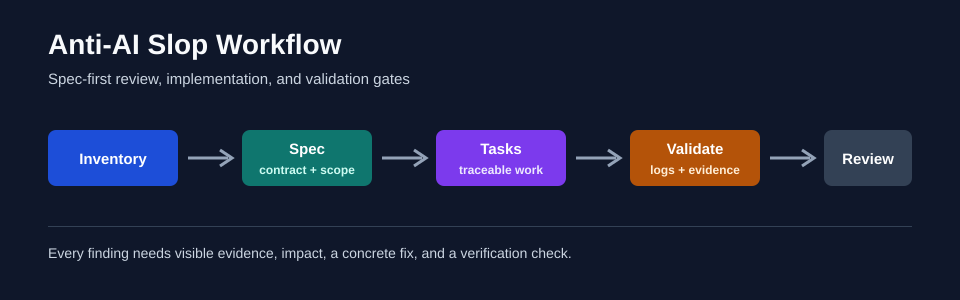

# Anti-AI Slop

[](https://github.com/ch040602/anti-ai-slop/actions/workflows/spec-coherence.yml)
[](https://github.com/ch040602/anti-ai-slop/actions/workflows/no-ai-slop.yml)

Anti-AI Slop is a Codex skill and Spec Kit guardrail pack for reviewing generic, template-like, or low-specificity outputs without making AI-authorship claims.

It turns vague feedback like "this feels generic" into visible evidence, concrete fixes, and validator-backed checks.

## Highlights

- Review writing, UI, decks, code, charts, and plans for purpose fit and specificity.
- Add repository guardrails with `.specify/` memory, Codex prompts, checklists, validators, and CI examples.
- Run the coherence gate with standard-library Python; no service, API key, or package install required.
- Apply the pack to another repo with dry-run and merge modes that preserve existing files.



## Quick Start

Install as a Codex skill:

```powershell
git clone https://github.com/ch040602/anti-ai-slop.git C:\Users\%USERNAME%\.codex\skills\anti-ai-slop
```

Start a new Codex session, then invoke it:

```text
$anti-ai-slop Review this README for generic claims, missing proof, and concrete fixes.
```

Run the self-check:

```powershell
python tools\validators\check_all.py --root . --profile pack-self --format markdown
python -m unittest discover -s tests
```

## Actual Logs

Self-check:

```text
$ python tools\validators\check_all.py --root . --profile pack-self --format markdown
# Anti-AI Slop Coherence Report (pack-self)
Score: 100
CRITICAL: 0
HIGH: 0
MEDIUM: 0
LOW: 0
No findings.
```

Inventory excerpt:

```text
$ python tools\repo_inventory.py --root . --format markdown
# Existing Code Scan
Files: 97
Top directories: tools, dimensions, checklists, .specify, specs, docs
Priority files: SKILL.md, README.md, AGENTS.md, tools/validators/check_all.py
```

Guardrail apply dry-run excerpt:

```text
$ python tools\apply_guardrails.py --target C:\tmp\anti-ai-slop-demo --mode dry-run
copy .specify/memory/constitution.md
copy SKILL.md
skip existing README.md
copy tools/validators/check_all.py
```

## Modes

| Mode | Use it for | Entry point |
|---|---|---|
| Review skill | Critique or rewrite one artifact. | `$anti-ai-slop Review ...` |
| Guardrail pack | Add spec-first review and validation gates to a repo. | `python tools\apply_guardrails.py ...` |

## Guardrail Pack

Apply to another repository:

```powershell
git clone https://github.com/ch040602/anti-ai-slop.git C:\tmp\anti-ai-slop

python C:\tmp\anti-ai-slop\tools\apply_guardrails.py `
  --source C:\tmp\anti-ai-slop `
  --target C:\path\to\repo `
  --mode dry-run

python C:\tmp\anti-ai-slop\tools\apply_guardrails.py `
  --source C:\tmp\anti-ai-slop `
  --target C:\path\to\repo `
  --mode merge `
  --manifest-out C:\path\to\repo\.anti-ai-slop-apply-manifest.json
```

Validation profiles:

| Profile | Scope |
|---|---|
| `pack-self` | Full self-check for this repository. |
| `target-repo` | Checks for a repository that adopted the pack. |
| `feature --feature FEATURE_DIR` | Checks scoped to one feature under `specs/`. |
| `ci-strict` | CI gate using the full pack scope. |

The main validator is `tools/validators/check_all.py`. Detailed validators include `check_config_integrity.py`, `check_evidence_links.py`, `check_template_tokens.py`, `check_workflow_integrity.py`, and `tools/resource_catalog_freshness.py`. Shared config may live at `config/guardrails.json` or `config/guardrails.yaml`. Dependency baseline lives at `dependency-baseline.json`.

## Installation In Other Runtimes

### Claude Code

Use this repository as a skill:

```powershell
mkdir .claude\skills
git clone https://github.com/ch040602/anti-ai-slop.git .claude\skills\anti-ai-slop
```

Claude Code can also use `CLAUDE.md` as project guidance.

### Other Agent Runtimes

Use `SKILL.md` as the primary instruction file, keep `AGENTS.md` or `CLAUDE.md` when the runtime understands them, and run validators directly in scripts or CI.

## Repository Layout

```text
anti-ai-slop/
+-- SKILL.md
+-- AGENTS.md
+-- CLAUDE.md
+-- .specify/
+-- codex/prompts/
+-- protocols/
+-- dimensions/
+-- checklists/
+-- tools/
+-- tests/
+-- docs/
+-- assets/
```

## GitHub About Metadata

Description:

```text
Evidence-backed Codex skill and Spec Kit guardrail pack for reviewing generic, template-like, or low-specificity outputs without making AI-authorship claims.
```

Tags:

```text
codex-skill, spec-kit, guardrails, ai-slop, output-quality, prompt-engineering, code-review, documentation-review, validation, agent-workflows
```

## Boundaries

Anti-AI Slop does not detect whether a person used AI, accuse authors, optimize for AI-detector evasion, or replace factual, legal, security, accessibility, or domain expert review.

## Development

```powershell
python tools\validators\check_all.py --root . --profile pack-self --format markdown
python -m unittest discover -s tests
python -m compileall tools tests
```

For pack-level behavior changes: Update `VERSION`, `CHANGELOG.md`, `SKILL.md`, and `manifest.txt`.
